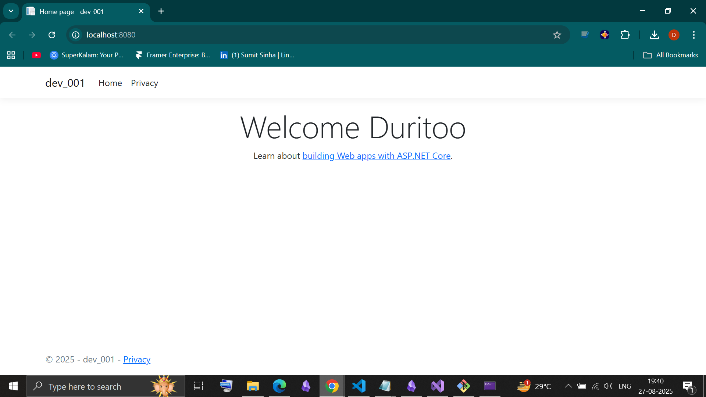

# pr_001


***


## About
This is a .NET 8 Web API project named dev_001 that I built and containerized using Docker. The goal was to create a clean, working web app that runs both locally and inside a Docker container.

***

## What I Have Done So Far

Created the .NET 8 project and confirmed it runs locally without errors.

Set up a GitHub repository and pushed the project code.

Built a GitHub Actions workflow that automatically builds and tests the app on every commit, showing pass/fail results.

Wrote a Dockerfile to containerize the app efficiently using multi-stage builds.

Successfully built and ran the app inside a Docker container on my machine.

Verified port forwarding so the app is accessible on http://localhost:8080.

Created another GitHub Actions workflow for CI/CD to build, test, and push Docker images to Docker Hub.

Verified the Docker image was pushed and ran it remotely from Docker Hub.

***

## How to Run Locally

1. Run the app using:

   ```bash
   dotnet run
   ```

2. Visit the URLs shown to access it.

***

## How to Run in Docker

1. Build the Docker image:

   ```bash
   docker build -t dev_001_image .
   ```

2. Run the Docker container:

   ```bash
   docker run -d -p 8080:80 --name dev_001_container dev_001_image
   ```

3. Open  browser at:

   ```
   http://localhost:8080
   ```

***
## Demo


